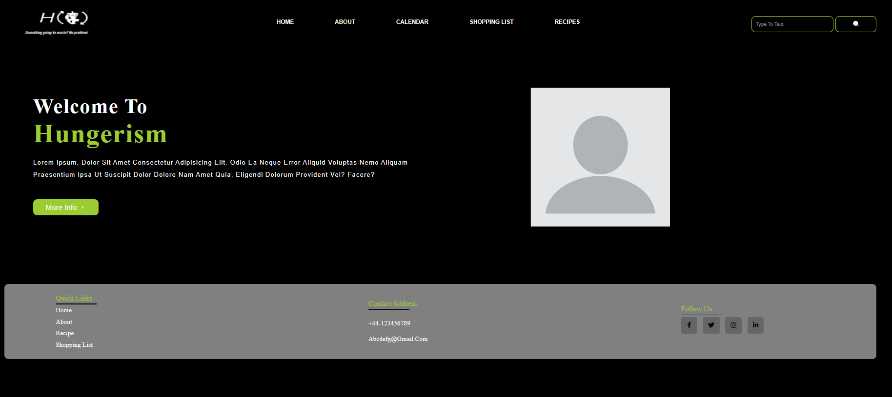
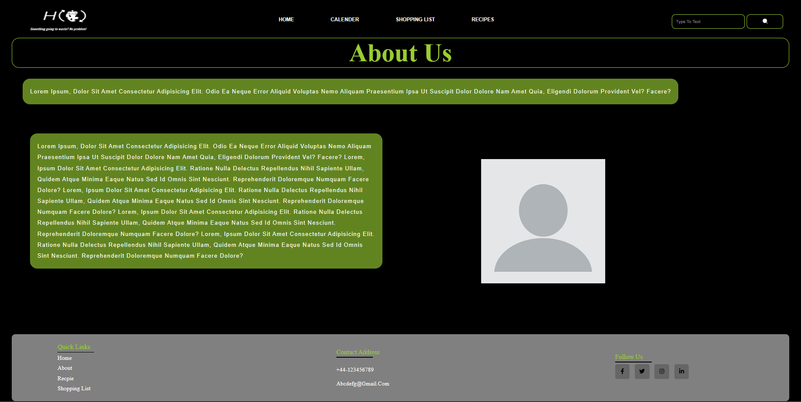
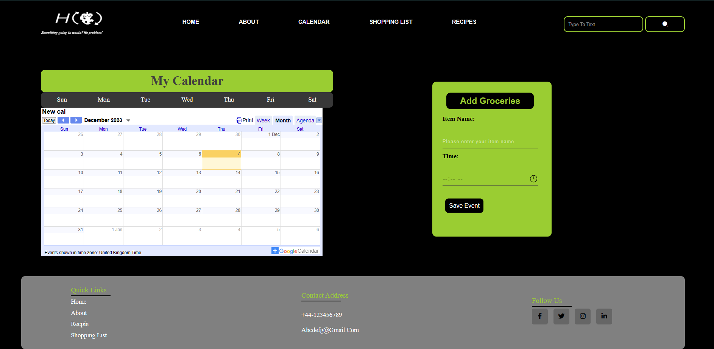
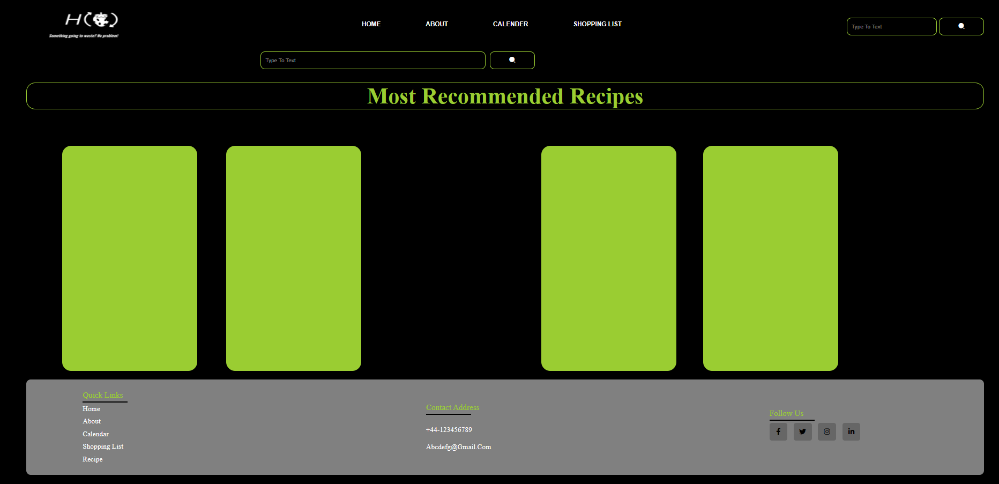
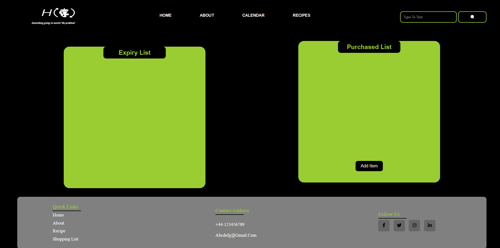

# Project-1 Hungerism

This project challenge is to create an application with a group of three member.Together the team includes Ben, Kurre Sai Lakshma Reddy, and Glenda.This application allows you to enter data about the food you have purchased. It will grab the information for the best storage times to keep your food for when it becomes time for the food to be used up and recommend recipes so that food waste can be minimized.

## Task needed to achieve this module

* Home Page
* About Page
* Shopping list Page
* Calendar Page
* Recipes Page
* Navbar with search
* Footer
* Reference page to sources

## Installation

N/A

## Usage 

N/A

## Output of the website

## Link to deployed application

(https://fr3lancer17.github.io/Hungerism/)

## License

none
